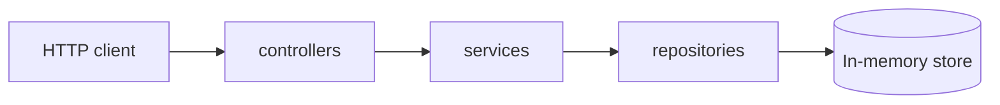

# Backend architecture

Layered structure for the SPS Group user management API.

## Layers

| Layer        | Responsibility |
| ------------ | -------------- |
| **Controller** | HTTP: parse request, call service, map response/status codes. |
| **Service**    | Business rules, orchestration, validation beyond persistence. |
| **Repository** | Data access abstraction; in-memory implementation with Repository pattern. |

**Middlewares** handle cross-cutting concerns (e.g. JWT authentication) before controllers.

**docs** (under `src/docs`) holds OpenAPI / Swagger JSDoc sources and shared spec helpers.

## Conventions

- Code, identifiers, and tests are in **English**.
- Tests use **Vitest**, **AAA** (Arrange, Act, Assert), and names: `Should [outcome] When [scenario]`.

## API documentation

- **Swagger UI:** `GET /api-docs` (development server URL may vary by `PORT`).
