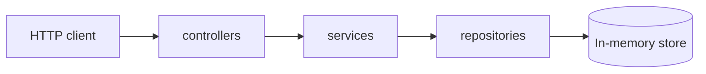

# Backend architecture

Layered structure for the SPS Group user management API.

## Layers

| Layer        | Responsibility |
| ------------ | -------------- |
| **Controller** | HTTP: parse request, call service, map response/status codes. |
| **Service**    | Business rules, orchestration, validation beyond persistence (e.g. `AuthService` issues JWT on login). |
| **Repository** | Data access abstraction; in-memory implementation with Repository pattern. |

**Persistence:** `InMemoryUserRepository` (`src/repositories/inMemoryUserRepository.js`) keeps users in process memory, indexes emails for uniqueness, and seeds the required admin user on construction.

**Middlewares** handle cross-cutting concerns before controllers. `createAuthMiddleware()` (`src/middlewares/authMiddleware.js`) validates `Authorization: Bearer <JWT>`, maps claims to `req.user`, and responds with `401` when the token is missing or invalid.

**docs** (under `src/docs`) holds OpenAPI / Swagger JSDoc sources and shared spec helpers.

## Conventions

- Code, identifiers, and tests are in **English**.
- Tests use **Vitest**, **AAA** (Arrange, Act, Assert), and names: `Should [outcome] When [scenario]`.
- Application code stays **CommonJS** (`require`); Vitest suites use **ESM** (e.g. `*.test.mjs` with `import`) because Vitest 3 does not support `require("vitest")`.

## API documentation

- **Swagger UI:** `GET /api-docs` (development server URL may vary by `PORT`).
