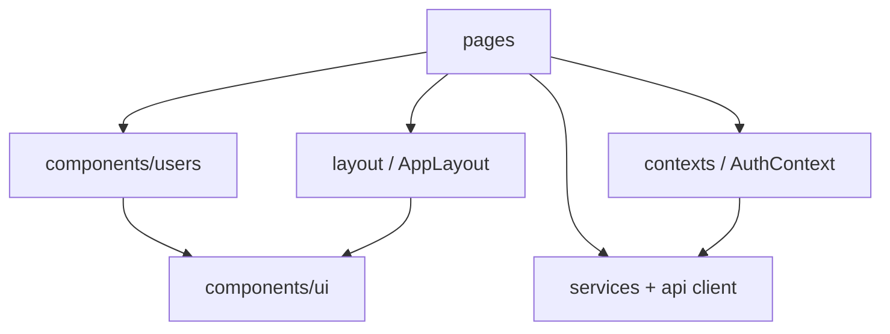

# Front-end architecture

React SPA for the SPS Group user management UI, organized by feature and shared UI.

## High-level structure

| Area | Role |
| ---- | ---- |
| **`src/pages`** | Route-level screens (`SignIn`, `Users`). |
| **`src/components/layout`** | Shell: header, user menu, children outlet. |
| **`src/components/ui`** | Reusable primitives: `Button`, `Input`, `Select`, `Card`, `Modal`. |
| **`src/components/users`** | User domain: modals (create/edit/delete), `UserSearchInput`, types. |
| **`src/contexts`** | `AuthProvider` — JWT in `localStorage`, axios token injection. |
| **`src/services` / `src/api`** | HTTP calls to the REST API (`userApi`, `client` with interceptors). |
| **`src/utils`** | Validation helpers, API error mapping, client-side user list filter. |

## Routing & auth

- **Public:** `/login` — sign-in form.
- **Protected:** `/users` — wrapped in `ProtectedRoute`; unauthenticated users redirect to login.
- Token stored under a stable key; logout clears state and storage.

## Testing

- **Vitest** + **React Testing Library** (JSDOM).
- **AAA** naming: `Should [outcome] When [scenario]`.
- Business logic covered in pure functions (`userFormValidation`, `userListFilter`, etc.).

## Conventions

- UI copy in **Portuguese (pt-BR)**; code and identifiers in **English**.
- Styling with **Tailwind CSS** and design tokens under `sps.*` in `tailwind.config.js`.
